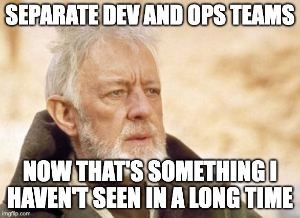
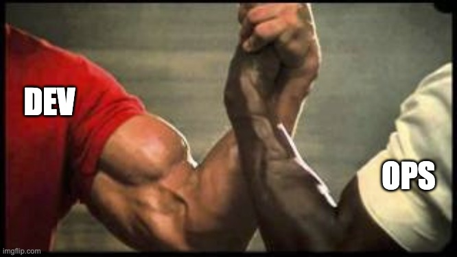
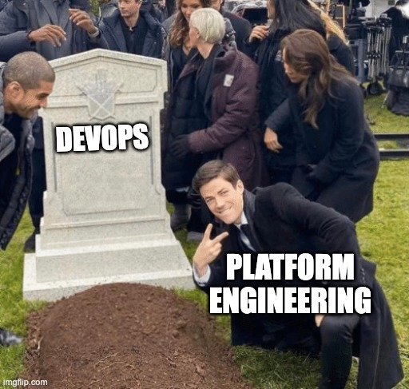
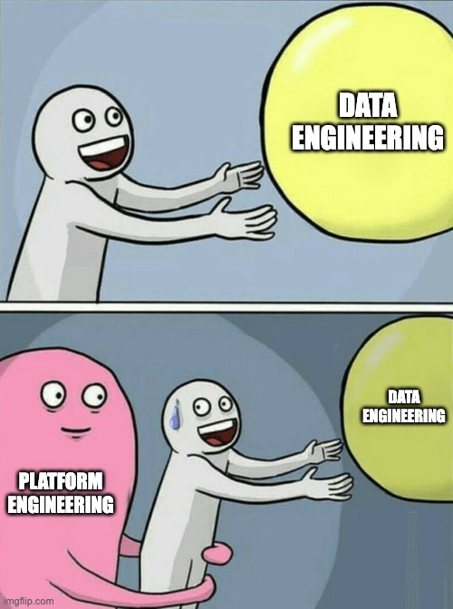
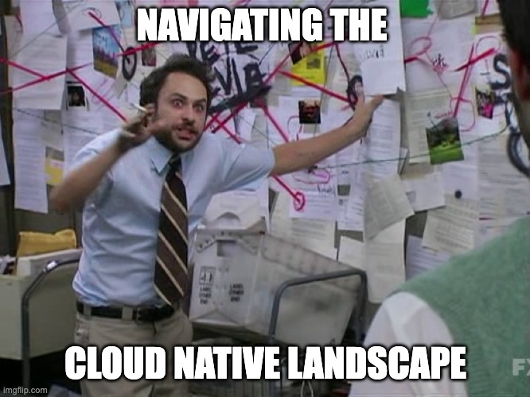
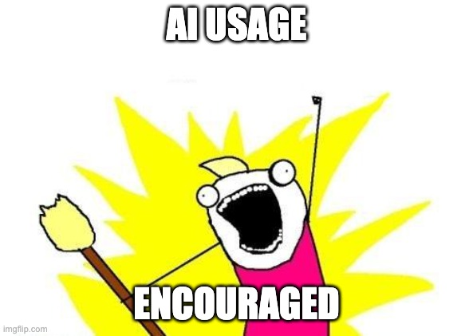

# Introduction

vvv

## A (Very) Brief History

#### Team Philosophies

<!-- .slide: class="center" -->

vvv

## Separate Dev & Ops ⚔️ ☠️

<!-- .element: class="r-stretch" -->

vvv

## DevOps 🤝 ✅

<!-- .element: class="r-stretch" -->

> You build it, you run it.
> 
> – Werner Vogels, Amazon [^you-build-it-you-run-it]

[^you-build-it-you-run-it]: <https://queue.acm.org/detail.cfm?id=1142065>

vvv

## Long Live Platform Engineering? 🏗️ 👑

<!-- .element: class="r-stretch" -->

[^platform-engineering-vs-devops]

[^platform-engineering-vs-devops]: <https://keploy.io/blog/community/platform-engineering-vs-devops>

vvv

## Why Platform Engineering? 💡

- Challenges with DevOps:
  - DevOps teams overloaded with too many responsibilities
  - Managing infrastructure is complex and time-consuming
  - Developer experience still poor
  - Fragmented toolchains
- Platform engineering for the win!

vvv

## What is Platform Engineering? ✨

- **Platform-as-a-product** – (Internal) Developer Platform
- Shift responsibilities for managing core infrastructure to a centralized team
- Provide self-service capabilities to development teams
- Improve developer experience
- Increase productivity

vvv

## Isn't This Data Engineering? 🤔

<!-- .element: class="r-stretch" -->

vvv

## Data Engineering 🚧

- Handling data requires large-scale compute, storage ➡️ cloud
- **Data engineering** also means managing infrastructure
- Build a **data platform** 🙌
- Apply platform engineering principles
- Enable data teams to focus on data, not infrastructure
- Platform engineering as a foundation for data engineering 💪

vvv

## Kubernetes 

- Kubernetes is the de facto standard for container orchestration
- But it's more than that!
- Most important characteristics: declarative and extensible 🤯
- Orchestrate containers, applications, infrastructure, and anything really
- Kubernetes is **a platform for building platforms** [^k8s-platform]
- Huge ecosystem of tools and extensions 🤩
- Kubernetes as the backbone of _cloud native_ platforms 🏗️

[^k8s-platform]: <https://www.opensourcerers.org/2021/12/06/kubernetes-is-a-platform-for-building-platforms/>

vvv

## Cloud Native ☁️✨

> Cloud native practices empower organizations to develop, build, and deploy workloads in computing environments (public, private, hybrid cloud) to meet their organizational needs at scale in a programmatic and repeatable manner.
> 
> It is characterized by loosely coupled systems that interoperate in a manner that is secure, resilient, manageable, sustainable, and observable.
> 
> – Cloud Native Computing Foundation [^cloud-native-definition]

[^cloud-native-definition]: <https://github.com/cncf/toc/blob/main/DEFINITION.md>

vvv

## Cloud Native Computing Foundation (CNCF) 🏛️

- Ecosystem of open source projects around cloud native technologies
- Hosts Kubernetes and many related projects 🤓
- Provides basis for building cloud native platform engineering solutions
- Extremely vast landscape: <https://landscape.cncf.io>

vvv

<!-- .element: class="r-stretch" -->

vvv

## Course Goals 🎯🏆

- Introduction to the cloud native ecosystem
- Practical skills in building cloud native platforms
- **Hands-on experience** with common tools in the cloud native ecosystem
  - a.k.a. the️ Cloud native toolkit ☁️ ✨
- Prepare for real-world challenges in platform/data engineering

vvv

## A Word on AI 🤖

<!-- .element: class="r-stretch" -->

⚠️ But: double-check results and ensure you understand them ‼️
