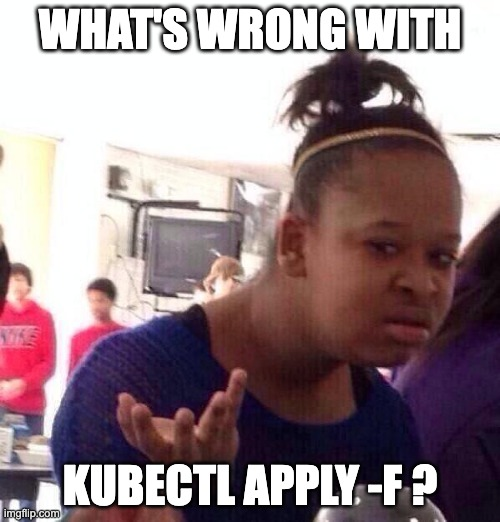

# Deployment Tooling

### Kustomize

vvv


<!-- .element: class="r-stretch" -->

vvv

## What's Wrong With `kubectl apply -f`?

- Declares the desired state based on raw YAML manifests
- Managing raw YAML manifests can be cumbersome
- Duplication of common configuration
- No easy way to customize manifests for different environments
- No support for packaging, versioning, or distribution

vvv

## Kustomize

- Allows customizing YAML manifests for different environments
- Kubernetes-native tool built around the **Kubernetes resource model** [^krm][^api-concepts]
- Core primitive: Kubernetes API object
- Supports layering and composition of configurations
- No templating, uses patches and overlays instead

```bash
# build a kustomization
kubectl kustomize ./path/to/kustomization
# build and apply a kustomization, note the -k flag!
kubectl apply -k ./path/to/kustomization
```

[^krm]: <https://github.com/kubernetes/design-proposals-archive/blob/main/architecture/resource-management.md>
[^api-concepts]: <https://kubernetes.io/docs/reference/using-api/api-concepts/>

vvv


<!-- .element: class="r-stretch" -->

vvv

## Kustomization

kustomization = directory + `kustomization.yaml`

- Defines a final set of Kubernetes resources
- Resources: files and other (remote) kustomizations to include
- Generators for `ConfigMap` and `Secret` objects
- Patches: mutate resources
- Transformers: common mutations, e.g.: setting namespace or labels

vvv

## Kustomization Example

```yaml[1-3|5|7-9|11-15]
# kustomization.yaml
apiVersion: kustomize.config.k8s.io/v1beta1
kind: Kustomization

namespace: platform-engineering

resources:
- deployment-slides.yaml
- service-slides.yaml

configMapGenerator:
- name: slides-config
  literals:
  - course=platform-engineering
  - base_url=https://talks.timebertt.dev/platform-engineering/
```

vvv

## Kustomize Generators

```yaml[1-6|8-13]
# kustomization.yaml
configMapGenerator:
- name: slides-config
  literals:
  - course=platform-engineering
  - base_url=https://talks.timebertt.dev/platform-engineering/

generatorOptions:
  # By default, a hash of the content is appended to the name.
  # This rolls out referencing deployments when the content changes.
  # But also leaves behind old config maps.
  # For a stable name, disable the suffix hash:
  disableNameSuffixHash: true
```

vvv

## Strategic Merge Patch

```yaml[1-5|6-10|10-13|15-17]
# patch-deployment-dev.yaml
apiVersion: apps/v1
kind: Deployment
metadata:
  name: slides
spec:
  template:
    spec:
      containers:
        - name: server # strategic merge by name
          env:
          - name: ENV
            value: "development"

# kustomization.yaml
patches:
- path: patch-deployment-dev.yaml
```

vvv

## JSON Patch (RFC 6902)

```yaml[1-3|4-6|8-11|12-14]
# kustomization.yaml
patches:
- path: patch-deployment-dev.yaml
  target:
    kind: Deployment
    name: slides

# patch-deployment-dev.yaml
- op: add
  # caution: hard-coded index instead of name selector
  path: /spec/template/spec/containers/0/env/-
  value:
    name: ENV
    value: "development"
```

vvv

## Remote Resources

```yaml[1-3|4-5|6-7]
# kustomization.yaml
resources:
- github.com/stefanprodan/podinfo//kustomize
# optionally, with specific ref (branch, tag, commit)
- github.com/stefanprodan/podinfo//kustomize?ref=6.9.2
# single file from URL
- https://raw.githubusercontent.com/stefanprodan/podinfo/refs/heads/master/kustomize/deployment.yaml
```

vvv

## Kustomize Overlays

```text[1-5|6-9|10-12]
deploy
├── base
│   ├── deployment.yaml
│   ├── service.yaml
│   └── kustomization.yaml
└── overlays
    ├── development
    |   ├── patch-deployment.yaml
    │   └── kustomization.yaml
    └── production
        ├── patch-deployment.yaml
        └── kustomization.yaml
```

vvv

## Kustomize Overlays

```yaml[]
# deploy/overlays/*/kustomization.yaml
resources:
- ../../base

patches:
- path: patch-deployment.yaml

# additional resources, patches, or transformations
# specific to an individual environment...
```

vvv

## Lab: Kustomize

- Use [kustomize](https://kustomize.io/) to deploy the [podinfo](https://github.com/stefanprodan/podinfo) application.
- Define a base configuration and overlays for `development` and `production` environments.
- Deploy the variants in dedicated namespaces `podinfo-dev` and `podinfo-prod`.
- Set the UI message to "Hello, Platform Engineering!"
- The `development` environment should use the `latest` image tag and enable debug logging.
- The `production` environment should use the `6.9.0` image tag and expose the application via a `LoadBalancer` service on port `12000`. [^lb-restrictions]
- Verify the expected results by accessing the application using `kubectl port-forward` and the external IP of the LoadBalancer service (production environment only).

<!-- .element: style="font-size: 0.8em;" -->

[^lb-restrictions]: Due to [cluster limitations](https://github.com/timebertt/platform-engineering-lab/tree/main#limitations), only a single LoadBalancer can use a given port number. Ensure that the used ports do not conflict with other LoadBalancer services in your cluster. Otherwise, your service's external IP will remain `<pending>`.
