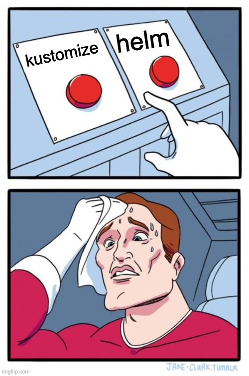

# Deployment Tooling

### Helm

vvv

## Helm

> The package manager for Kubernetes

- Uses reusable, parameterized templates called "charts"
- Handles configuration, upgrades, and rollbacks
- Large ecosystem of pre-built charts for popular software
- Simplifies deployment of "off-the-shelf" applications

vvv

## Helm Concepts

- **Chart**: A package of Kubernetes resources (e.g., collection of YAML templates)
- **Values**: Configuration data to customize a chart (parameters)
- **Release**: An instance of a chart running in a cluster
- **Repository**: A collection of published charts (e.g., [Artifact Hub](https://artifacthub.io/))

vvv

## Writing a Helm Chart

TL;DR: Use `helm create` to scaffold a chart

```text
$ helm create slides

slides/
├── .helmignore   # Contains patterns to ignore when packaging Helm charts.
├── Chart.yaml    # Information about your chart
├── values.yaml   # The default values for your templates
├── charts/       # Charts that this chart depends on
└── templates/    # The template files
    └── tests/    # The test files
```

vvv

## `Chart.yaml` Example

```yaml[]
# Chart.yaml
apiVersion: v2
type: application
name: slides
description: A Helm chart for deploying lecture slides
version: 0.1.0 # version shown in the chart repository
appVersion: "1.0.0" # typically used as the application image tag
```

vvv

## Example Template

```gotemplate[1-6|7-8|10-16|17-21]
apiVersion: apps/v1
kind: Deployment
metadata:
  name: {{ include "myapp.fullname" . }}
  labels:
    app: {{ include "myapp.name" . }}
spec:
  replicas: {{ .Values.replicaCount }}
  # ...
  template:
    spec:
      containers:
      - name: {{ .Chart.Name }}
        image: "{{ .Values.image.repository }}:{{ .Values.image.tag }}"
        ports:
        - containerPort: {{ .Values.service.port }}
        env:
        {{- range $key, $value := .Values.env }}
        - name: {{ $key }}
          value: "{{ $value }}"
        {{- end }}
```

vvv

## Publishing Charts to OCI Repositories

- Package chart:
  ```bash
  helm package ./slides
  # creates slides-0.1.0.tgz
  ```
- Push to an OCI registry:
  ```bash
  helm registry login ghcr.io
  helm push slides-0.1.0.tgz oci://ghcr.io/timebertt/charts
  ```
- Install from OCI registry:
  ```bash
  helm install slides oci://ghcr.io/timebertt/charts/slides --version 0.1.0
  ```

vvv

## Consuming Community Charts

- Consume a chart from an OCI registry (recommended):
  ```bash
  helm install my-prometheus oci://ghcr.io/prometheus-community/charts/prometheus \
    --namespace monitoring \
    --set server.persistentVolume.size=10Gi \
    --values my-values.yaml
  ```
- Alternatively, add an HTTPS repository and fetch its charts (legacy):
  ```bash
  helm repo add prometheus-community https://prometheus-community.github.io/helm-charts
  helm repo update

  helm install my-prometheus prometheus-community/prometheus \
    --namespace monitoring \
    --set server.persistentVolume.size=10Gi \
    --values my-values.yaml
  ```

vvv

## More Helm Commands

- `helm list` – List releases installed in the cluster
- `helm upgrade --install ...` – Install or upgrade a release
- `helm uninstall <release>` – Remove a release
- `helm show values <chart>` – Show configurable values of a chart

vvv

## Lab: Helm

- Deploy the [podinfo](https://github.com/stefanprodan/podinfo) application – as done previously in the [Kustomize lab](#/lab-kustomize) – but this time using [Helm](https://helm.sh/).
- To prevent conflicts with the previous lab, use new namespaces `podinfo-helm-dev` and `podinfo-helm-prod`.
- To avoid port conflicts with the previous lab, set the LoadBalancer service's `http` port in production to `12001` and disable the `grcp` port (set the `service.grpcPort` value to `null`). [^lb-restrictions]

[^lb-restrictions]: Due to [cluster limitations](https://github.com/timebertt/platform-engineering-lab/tree/main#limitations), only a single LoadBalancer can use a given port number. Ensure that the used ports do not conflict with other LoadBalancer services in your cluster. Otherwise, your service's external IP will remain `<pending>`.

vvv


<!-- .element: class="r-stretch" -->

vvv

## Kustomize vs. Helm

| Kustomize                                | Helm                         |
|------------------------------------------|------------------------------|
| Native Kubernetes tool                   | Separate tool                |
| Composes and transforms objects          | Go templates over YAML files |
| Simpler, less abstraction                | More powerful customization  |
| No built-in distribution[^flux-artifact] | Chart repositories           |
| No resource tracking[^flux-tracking]     | Release tracking, rollbacks  |

[^flux-artifact]: Apart from Git-based distribution, Kustomizations can be distributed via OCI artifacts using the [Flux CLI](https://fluxcd.io/flux/cheatsheets/oci-artifacts/) (supports arbitrary manifests).
[^flux-tracking]: Flux tracks all resources belonging to `Kustomizations` and can [garbage collect resources](https://fluxcd.io/docs/components/kustomize/kustomization/#prune) automatically.

vvv

## TL;DR: When to Choose What?

- Use Helm for consuming and distributing reusable application charts
- Use Kustomize for everything else, especially non-reusable manifests
