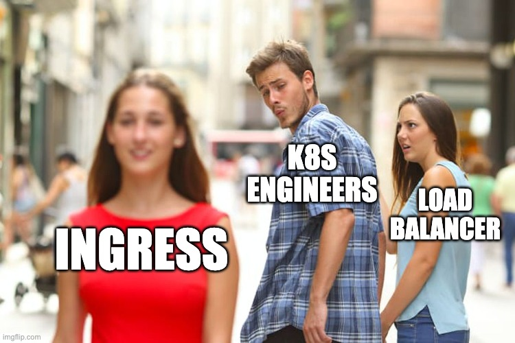

# Handling Incoming Traffic

### L7 Load Balancing With ingress-nginx

vvv

## What We Have So Far

LoadBalancer Service exposes services externally (L4 load balancing)


<!-- .element: class="r-stretch" -->

vvv

## What We Want To Have

- Use a single LoadBalancer for multiple services
- Perform host and path-based routing (L7 load balancing)
- Terminate TLS connections (HTTPS)


<!-- .element: class="r-stretch" -->

vvv

## The `Ingress` Resource

- Built-in Kubernetes API
- Defines traffic routing rules for HTTP/HTTPS
- Routes traffic to backend Services based on host and path
- Requires an Ingress controller to implement it

vvv

## Ingress Example

```yaml[|6-7|8-11|12-17]
apiVersion: networking.k8s.io/v1
kind: Ingress
metadata:
  name: podinfo
spec:
  rules:
  - host: podinfo.example.com
    http:
      paths:
      - path: /
        pathType: Prefix
        backend:
          service:
            name: podinfo
            port:
              name: http
              # number: 80 # alternative
```

vvv

## ingress-nginx Overview

- _The_ Ingress controller for Kubernetes [^ingress-nginx-retirement]
- Maintained by the Kubernetes community: [kubernetes/ingress-nginx](https://github.com/kubernetes/ingress-nginx/)
- Runs as a Deployment in your cluster
- Controller configures an NGINX proxy based on Ingress resources
- Exposes all Ingresses via a single LoadBalancer
- Supports advanced features via annotations: authentication, rate limiting, custom error pages, etc.

[^ingress-nginx-retirement]: That was, until ingress-nginx was [announced to be retired](https://kubernetes.io/blog/2025/11/11/ingress-nginx-retirement/) in March 2026.

vvv

## Aside: Gateway API

- [Gateway API](https://gateway-api.sigs.k8s.io/) is a new standard for L4 and L7 load balancing in Kubernetes
- Provides more flexibility and extensibility than the `Ingress` API
- Supports multiple protocols (HTTP/S, TLS, TCP, UDP, gRPC)
- Deals with `GatewayClass`, `Gateway`, and `*Route` resources
- Better separation of concerns (Gateway, Route, Backend)
- Still evolving, support is still limited

vvv

## Lab: ingress-nginx

- [Deploy ingress-nginx](https://kubernetes.github.io/ingress-nginx/deploy/) using a Flux `HelmRelease`. [^lb-restrictions]
- Add an `Ingress` resource to the `podinfo` application from the [Kustomize Lab](#/lab-kustomize). [^ingress-class]
- Choose different hostnames for the `development` and `production` environments.
- Test access to the application environments using `curl` on the external IP of the Ingress objects and the configured hostnames.
- As there are no DNS records for the chosen hostnames yet, use curl's `--resolve` option or set the `Host` header to test access.

<!-- .element: style="font-size: 0.8em;" -->

[^lb-restrictions]: Keep in mind the cluster's [LoadBalancer limitations](https://github.com/timebertt/platform-engineering-lab/tree/main#limitations): only a single LoadBalancer can use a given port number. Ensure that the ingress-nginx LoadBalancer is the only Service listening on port `80` and `443`. Otherwise, the service's external IP will remain `<pending>`. I.e., delete the `nginx` LoadBalancer Service created in the first lab.
[^ingress-class]: Tip: the `Ingress.spec.ingressClassName` field specifies which Ingress controller should handle the Ingress resource. You either need to specify `nginx` explicitly, or configure the `HelmRelease` to make `nginx` the default `IngressClass`.
