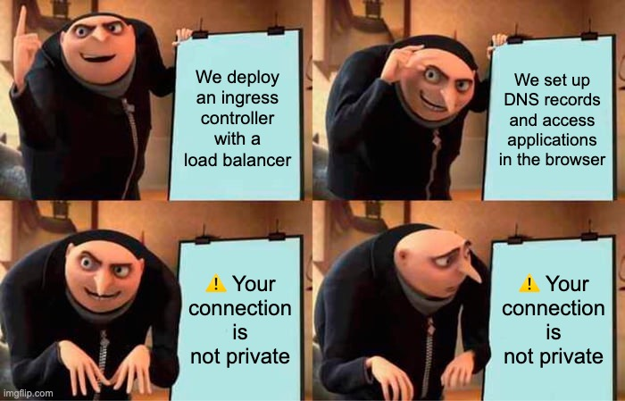

# Managing TLS Certificates

### cert-manager

vvv


<!-- .element: class="r-stretch" -->

vvv

## Motivation

- Secure communication is essential for modern web applications
- TLS certificates are required for HTTPS
- Manual certificate management is error-prone and very time-consuming
- Automation reduces risk and operational overhead

vvv

## cert-manager

- Kubernetes controller to automate TLS certificate management
- CNCF Graduated Project: [cert-manager/cert-manager](https://github.com/cert-manager/cert-manager)
- Requests/issues certificates from various certificate authorities (e.g., Let's Encrypt, custom CA, self-signed, etc.)
- Automatically renews certificates before expiration
- Integrates with Kubernetes resources like Ingress

vvv

## `Certificate` Resource

```yaml[1-5|6-11|12-14|15]
apiVersion: cert-manager.io/v1
kind: Certificate
metadata:
  name: podinfo
  namespace: podinfo-dev
spec:
  dnsNames:
  - podinfo-dev.example.com
  usages:
  - digital signature
  - key encipherment
  issuerRef:
    kind: ClusterIssuer
    name: letsencrypt
  secretName: podinfo-tls
```

vvv

## `Issuer` and `ClusterIssuer` Resources

```yaml[1-5|6-8|9-11|12-15|12,16-18]
apiVersion: cert-manager.io/v1
kind: Issuer # or ClusterIssuer
metadata:
  name: letsencrypt
  namespace: cert-manager # omit for ClusterIssuer
spec:
  acme:
    server: https://acme-v02.api.letsencrypt.org/directory
    email: user@example.com
    privateKeySecretRef:
      name: letsencrypt
    solvers:
    - http01:
        ingress:
          ingressClassName: nginx
    - dns01:
        cloudDNS:
          # ...
```

vvv

## `Ingress` Integration

```yaml[1-4|9-14|15-18|5-8]
apiVersion: networking.k8s.io/v1
kind: Ingress
metadata:
  name: podinfo
  annotations:
    cert-manager.io/issuer: letsencrypt
    # or
    cert-manager.io/cluster-issuer: letsencrypt
spec:
  rules:
  - host: podinfo.example.com
    http:
      paths:
      # ...
  tls:
  - hosts:
    - podinfo-dev.example.com
    secretName: podinfo-tls
```

vvv

## Let's Encrypt

- Free, automated, and open Certificate Authority
- Popular choice for cert-manager
- Issues short-lived certificates (90 days)
- ACME protocol for proving domain ownership and certificate issuance

vvv

## ACME HTTP01 Challenge

- Proves domain ownership via HTTP
- cert-manager creates a temporary `Ingress`
- Serves a challenge response at a specific path
- Let's Encrypt validates by accessing the challenge response
- Works well for public web services

vvv

## ACME DNS01 Challenge

- Proves domain ownership via DNS record
- cert-manager creates a temporary `TXT` DNS record
- Useful for wildcard certificates or non-public services
- Uses DNS provider integration (e.g., Google Cloud DNS, AWS Route 53, etc.)

vvv

## Lab: cert-manager

- Get the service account key from [Moodle](https://moodle.dhbw-mannheim.de/course/section.php?id=103110) and create a Kubernetes secret in the `cert-manager` namespace (don't commit the key to Git!):
  ```bash
  kubectl create namespace cert-manager
  kubectl -n cert-manager create secret generic google-clouddns --from-file service-account.json=key.json
  ```
- [Deploy cert-manager](https://cert-manager.io/docs/installation/helm/) in the `cert-manager` namespace using a Flux `HelmRelease`.
- Create a `ClusterIssuer` for Let's Encrypt using the [ACME DNS01 challenge with Google Cloud DNS](https://cert-manager.io/docs/configuration/acme/dns01/google/). [^lets-encrypt-staging]
- Update the `Ingress` manifests of the `podinfo` application from the [Kustomize Lab](#/lab-kustomize) to terminate TLS connections and request a certificate from the configured `ClusterIssuer`.
- Verify access to the application environments using `curl` and your browser with the configured hostnames.

<!-- .element: style="font-size: 0.8em;" -->

[^lets-encrypt-staging]: You can use the [Let's Encrypt Staging environment](https://letsencrypt.org/docs/staging-environment/) for testing and development purposes to avoid hitting rate limits.
