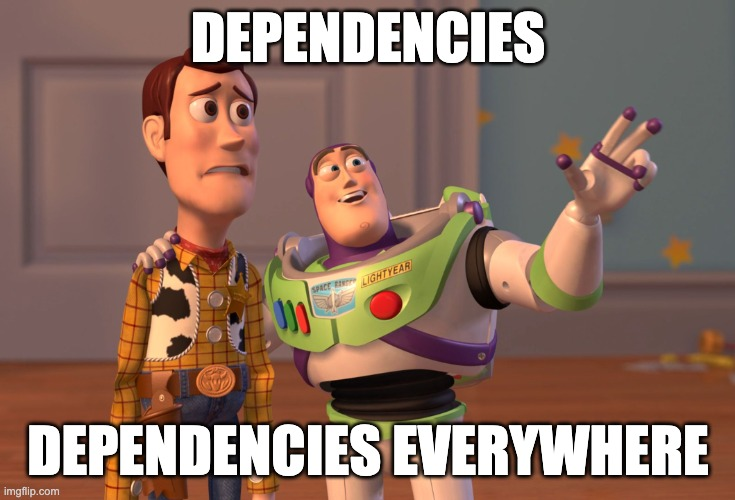

# Keeping Dependencies<br>Up-to-Date

### Renovate

vvv


<!-- .element: class="r-stretch" -->

vvv

## Motivation

- Keeping dependencies up-to-date is crucial for security and stability
- Manual updates are time-consuming and error-prone
- Automation tools can help streamline the update process

vvv

## What is Renovate?

- Open-source tool for automating dependency updates: [renovatebot.com](https://renovatebot.com/)
- Supports a wide range of package managers and ecosystems
- Can be self-hosted or used as a SaaS solution
- Integrates with Git platforms like GitHub, GitLab, and Bitbucket
- Creates pull requests with updated dependencies
- Provides release notes in pull requests
- Highly configurable to fit different workflows
- Supports scheduling, grouping, automerging, etc.

vvv

## Renovate Workflow

1. Scans the repository for dependencies
2. Checks for available updates
3. Creates pull requests for each update
4. Optionally runs tests and checks before merging
5. Waits for manual review or merges updates automatically

vvv

## Getting Started with Renovate

- [Install the Renovate GitHub App](https://docs.renovatebot.com/getting-started/installing-onboarding/) on your repository
- Renovate opens a pull request adding a simple `renovate.json` config file
- Review and customize the configuration as needed
- Merge the configuration PR to start receiving dependency update PRs
- Renovate opens a "Dependency Dashboard" issue to track updates

vvv

## `renovate.json` Example

```json[|2-4|5-7|8-14]
{
  "extends": [
    "config:recommended"
  ],
  "schedule": [
    "before 5am"
  ],
  "packageRules": [
    {
      "matchDatasources": ["go"],
      "matchUpdateTypes": ["minor", "patch"],
      "automerge": true
    }
  ]
}
```

vvv

## Configuration Presets

- Renovate includes several presets to simplify the repository configuration
- Enable presets using the `extends` field in `renovate.json`
- Examples:
  - `config:recommended`: Base recommended configuration
  - `:automergePatch`: Automatically merge patch updates
  - `schedule:earlyMondays`: Schedule updates for early Monday mornings
  - `group:kubernetes`: Group Kubernetes Go dependencies together

vvv

## Managers

- Renovate supports many package managers: npm, pip, Go modules (Go), Helm values, and many more
- Custom managers can be configured with regular expressions
- Managers define how to detect and update dependencies
- Each manager has specific configuration options

```json
{
  "kubernetes": {
    "managerFilePatterns": ["/\\.yaml$/"]
  }
}
```

vvv

## Datasources

- All detected dependencies are associated with a datasource
- Datasources define how Renovate looks for new versions
- Examples:
  - `pypi`: Finds new versions of Python packages on PyPI
  - `npm`: Finds new versions of Node.js packages on npm registry
  - `github-releases`: Finds the latest releases on GitHub
  - `docker`: Checks OCI registries (e.g., Docker Hub) for new image tags
  - `helm`: Checks Helm chart repositories for new chart versions

vvv

## Versioning

- Renovate understands different versioning schemes
- Can be configured per datasource, manager, or package
- Default is [Semantic Versioning](https://semver.org/) (semver)
  - Examples: `1.2.3`, `v2.0.0`
  - Pattern: `v<major>.<minor>.<patch>` (`v` prefix is optional)

vvv

## Package Rules

- Package rules customize Renovate's behavior for specific dependencies
- Use `matchDatasources`, `matchManagers`, `matchPackageNames`, etc. to select dependencies
- Define specific configuration like `automerge`, `schedule`, `groupName`, etc.
- Example: Automatically merge minor and patch updates for Go dependencies

vvv

## Testing Renovate Locally

```bash
# Install Renovate CLI
brew install renovate

# Validate your configuration file
renovate-config-validator

# Dry-run Renovate in the clone of your repository
# export LOG_LEVEL=debug # optional
export GITHUB_API_GITHUB_COM_TOKEN=$(gh auth token) # authenticate with GitHub
renovate --detect-host-rules-from-env --platform=local
```

vvv

## Lab: Renovate

- [Install the Renovate GitHub App](https://docs.renovatebot.com/getting-started/installing-onboarding/) on your repository
- Merge the initial configuration PR
- Allow automerging PRs in your repository settings: [docs](https://docs.github.com/en/pull-requests/collaborating-with-pull-requests/incorporating-changes-from-a-pull-request/automatically-merging-a-pull-request)
- Customize the `renovate.json` configuration file
  - Configure the file patterns of the [kubernetes](https://docs.renovatebot.com/modules/manager/kubernetes/), [flux](https://docs.renovatebot.com/modules/manager/flux/), and [helm-values](https://docs.renovatebot.com/modules/manager/helm-values/) managers to find all relevant files in your repository
  - Configure renovate to automerge all patch updates
  - Configure renovate to [ignore status checks](https://docs.renovatebot.com/key-concepts/automerge/#absence-of-tests) (`ignoreTests=true`) – we do not have any in this lab
- Test the configuration changes locally using the CLI
- Push the changes to your repository
- Observe the created pull requests for dependency updates
- Merge some updates and verify the changes in your cluster

<!-- .element: style="font-size: 0.8em;" -->
