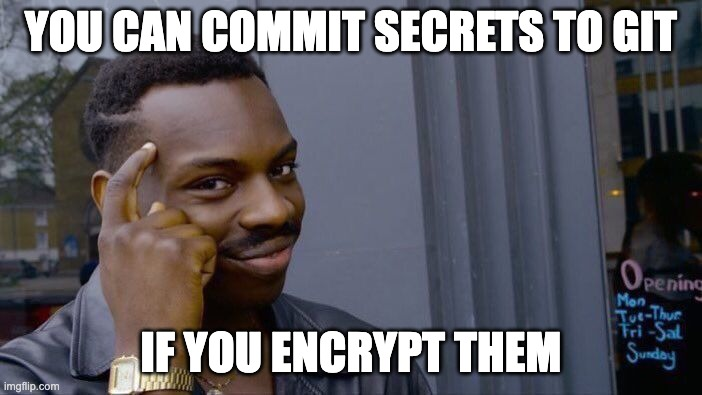
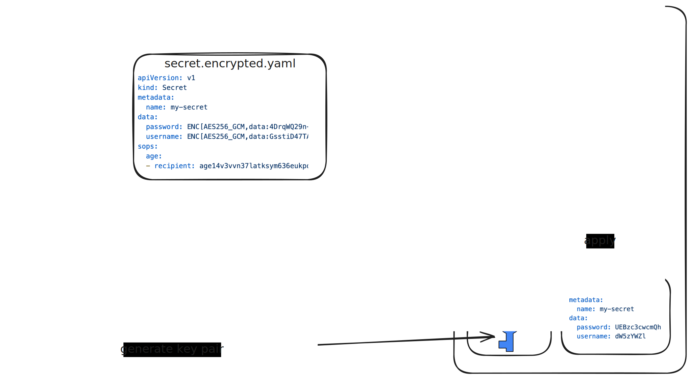

# Managing Secrets in GitOps

### Encrypting Secrets with SOPS

vvv

## Remember This One?


<!-- .element: class="r-stretch" -->

vvv

## How to Manage Secrets?


<!-- .element: class="r-stretch" -->

vvv

## What if We Encrypt the Secrets?


<!-- .element: class="r-stretch" -->

vvv

## Secrets Management Options

- Store secrets outside Git
  - HashiCorp Vault, AWS Secrets Manager, Azure Key Vault, etc.
  - Fetch secrets at runtime
  - ➡️ [External Secrets Operator](https://external-secrets.io/)
- Store encrypted secrets in Git
  - Encrypt secrets before committing to Git using [age](https://age-encryption.org/), GPG, etc.
  - Decrypt secrets at deployment time
  - ➡️ [SOPS](https://getsops.io/)

vvv

## Recommendation: Scan for Secrets

- Prevent unencrypted secrets in Git
- [gitleaks](https://github.com/gitleaks/gitleaks) detects secrets like API keys, passwords, tokens, etc.
- Install as a Git [pre-commit](https://pre-commit.com/) hook to prevent committing unencrypted secrets

vvv

## What is SOPS?

- SOPS = Secrets OPerationS
- CNCF project: [getsops/sops](https://github.com/getsops/sops)
- Command-line tool and library for encrypting, decrypting, and editing files
- Supports various encryption methods: age, GPG, Cloud KMS, etc.
- **Encrypts values in structured files**: YAML, JSON, ENV, INI
- Allows partial encryption of structured files (e.g., only specific fields in YAML)
- Also supports encrypting plain text files
- Integrated in GitOps tools like Flux [^flux-sops]

[^flux-sops]: <https://fluxcd.io/flux/guides/mozilla-sops/>

vvv

## SOPS Overview


<!-- .element: class="r-stretch" -->

vvv

## SOPS Workflow

1. Generate age key pair
2. Configure SOPS to use age
3. Create a secret file
4. Encrypt the secret file with SOPS
5. Commit the encrypted file to Git
6. Configure Flux to decrypt the file during deployment

vvv

## 1. Generate age Key Pair

```bash[1-2|4-5|7-8|10-12]
# Install SOPS and age
brew install sops age

# Don't commit the age private key to git
echo '*.agekey' >> .gitignore

# Generate a key pair
age-keygen -o age.agekey
```

vvv

## 2. Configure SOPS to Use age

```yaml[1-7|9-11|13-15]
# .sops.yaml
creation_rules:
  # Encrypt values of Kubernetes Secret YAML files
- path_regex: \.encrypted\.yaml$
  encrypted_regex: ^(data|stringData)$
  mac_only_encrypted: true
  age: age14v3vvn37latksym636eukpq0cy6kmakca627cycu723w4ykqf4wqm9ege5

# Encrypt plain text files ending with .encrypted
- path_regex: \.encrypted$
  age: age14v3vvn37latksym636eukpq0cy6kmakca627cycu723w4ykqf4wqm9ege5

stores:
  yaml:
    indent: 2
```

vvv

## 3. Create a Secret File

```bash
kubectl create secret generic my-secret \
  --from-literal=username=unsafe \
  --from-literal=password='P@ssw0rd!' \
  --dry-run=client -o yaml > secret.encrypted.yaml
```

⚠️ The file is still unencrypted at this point!

```yaml
# secret.encrypted.yaml
apiVersion: v1
kind: Secret
metadata:
  creationTimestamp: null
  name: my-secret
data:
  password: UEBzc3cwcmQh
  username: dW5zYWZl
```

vvv

## Aside: Base64 Encoding

Kubernetes Secret values are represented as [base64](https://developer.mozilla.org/en-US/docs/Glossary/Base64)-encoded strings.

> The Base64 format converts binary data into an ASCII string, ensuring compatibility with YAML and JSON formats used in Kubernetes manifests. However, Base64 encoding is not encryption — it offers no security but merely serves as a method for safely encoding data for transport and storage. [^secrets-base64]

➡️ Base64-encoded strings are essentially plain text! ⚠️

[^secrets-base64]: <https://medium.com/tuanhdotnet/handling-base64-encoded-data-in-kubernetes-secrets-77df09e6039d>

vvv

## 4. Encrypt the Secret File

```bash
sops encrypt --in-place secret.encrypted.yaml
```

✅ The file is encrypted now!

vvv

## 4. Encrypted Secret File

```yaml[1-6|7-9|10|11-20|22-26]
# secret.encrypted.yaml
apiVersion: v1
kind: Secret
metadata:
  creationTimestamp: null
  name: my-secret
data:
  password: ENC[AES256_GCM,data:4DrqWQ29n+DZmics,iv:B4XjHDPGEYxT98YwE/wnXoBnLtBgzN64XV2IGQp8qT4=,tag:gchmALfPM7k7Rc6lkMXRZw==,type:str]
  username: ENC[AES256_GCM,data:GsstiD47TAw=,iv:2aYf9nFaIeC/eea0q55wkCbcnBwGxqQAxFfTnH5Isq4=,tag:wMHCLBLid5Y9oqBYJIVnrA==,type:str]
sops:
  age:
  - recipient: age14v3vvn37latksym636eukpq0cy6kmakca627cycu723w4ykqf4wqm9ege5
    enc: |
      -----BEGIN AGE ENCRYPTED FILE-----
      YWdlLWVuY3J5cHRpb24ub3JnL3YxCi0+IFgyNTUxOSBMU3VyV0U2N0V6MEowOG9h
      YS9XMFRKZ3hZaUY5ci9BK0djcmxlZlVoY1FnCnhMWm11RHVERUVWNm1iNXNPRHQ3
      ZjJZaEtoblZ5UzVINm82b0VYQUo3bjQKLS0tIFRuV3UzenhlZlRrN21lRmczNWwz
      TUdyZ0x6VE1UMnRSbzFqZmFNUk9acjQKHFX/XOjF5jI3H2RtOGjE+ztmGQTdqcw3
      lIPVrwt/MCEJvgUJuZwLhC3Lsri37THOkG0YN0zAak+3kNNiESYFwQ==
      -----END AGE ENCRYPTED FILE-----

  lastmodified: "2025-11-16T13:17:04Z"
  mac: ENC[AES256_GCM,data:FaDdC3F4pZ2GL8qivwLcGah38ea3H7CMdti3K0EVtpxIXGtLGe2m++3fj2Kr4/yW+U8yyk0zjs6NxpZ28IN4LVlveSVmRqfuVJ0knPNC+YtkQz9Vp2MF/+ivshaeZXGQCJ/SGfCXprh0BfdDS8EJ4p3Z1RejAHE6cJALETcRWLM=,iv:euB2rCgqmcY/ivUHWteyoK8TcPbXkLwxF1jzJ1nCRU0=,tag:FSaQSVtFh3XPuGqXGnCJ6Q==,type:str]
  encrypted_regex: ^(data|stringData)$
  mac_only_encrypted: true
  version: 3.11.0
```

vvv

## 5. Commit the Encrypted File

```bash
git add .sops.yaml .gitignore
git add secret.encrypted.yaml

git commit
git push
```

vvv

## 6. Configure Secret Decryption in Flux

Create a Kubernetes secret to store the private key required for decryption:
```bash
kubectl -n flux-system create secret generic sops-age --from-file=age.agekey
```

Add decryption config to the Kustomization:
```yaml[1-7|9-12]
apiVersion: kustomize.toolkit.fluxcd.io/v1
kind: Kustomization
metadata:
  name: my-app
  namespace: flux-system
spec:
  path: ./deploy/my-app
  # ...
  decryption:
    provider: sops
    secretRef:
      name: sops-age
```

vvv

## Decrypt/Edit a Secret File

```bash
# Point SOPS to the age private key
# Needed for decrypting and editing encrypted files locally
export SOPS_AGE_KEY_FILE=$PWD/age.agekey

# Prints the decrypted content to stdout
# (does not modify the file)
sops decrypt secret.encrypted.yaml

# Decrypt the file, edit it, and re-encrypt on save
sops edit secret.encrypted.yaml
```

vvv

## Lab: SOPS

- Follow the [SOPS workflow](#/sops-workflow) from the slides
- Remember not to commit unencrypted secret files – and never the private age key! 
  - Optional: install [gitleaks](https://github.com/gitleaks/gitleaks)
- Set up [SOPS for encrypting secrets using age](https://getsops.io/docs/#encrypting-using-age)
- Add manifests for the Kubernetes secrets with the Google Cloud DNS service account for [external-dns](#/lab-external-dns) and [cert-manager](#/lab-cert-manager) (see the respective lab instructions)
- Encrypt the secret manifests
- Ensure the secret manifests are encrypted (look for `ENC[AES256_`) before committing to Git
- [Configure Flux to decrypt the secrets](https://fluxcd.io/flux/guides/mozilla-sops/) during deployment
- Bonus: add [basic authentication](https://kubernetes.github.io/ingress-nginx/examples/auth/basic/) on the `podinfo-dev` `Ingress` using a SOPS-encrypted `htpasswd` file

<!-- .element: style="font-size: 0.8em;" -->
