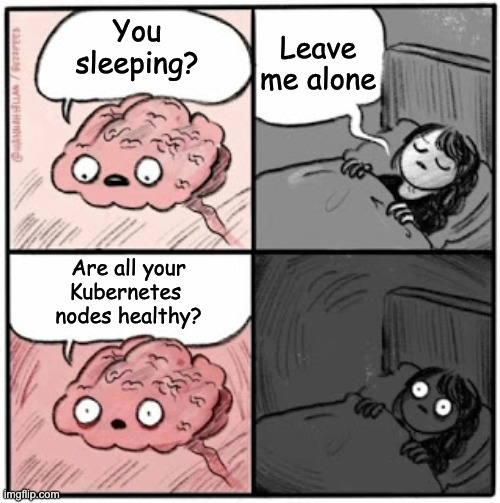

# Observability

### Monitoring Your Cluster With Kube-Prometheus-Stack

vvv

<!-- .element: class="r-stretch" -->

vvv

## What is Observability?

> Observability is the ability to understand the internal state of a system based on telemetry data it produces.

vvv

## Telemetry Data

- **Metrics**: Numerical data that represents the state of the system over time (e.g., CPU usage, memory consumption, request rates).
- **Logs**: Textual records of events that occur within the system (e.g., error messages, access logs).
- **Traces**: Detailed records of the execution path of requests through the system (e.g., distributed tracing).

ℹ️ In this lecture, we will focus primarily on metrics-based observability (monitoring) using the Kube-Prometheus-Stack.

vvv

## Why Observability?

- **Monitoring**: Keeping track of the health and performance of applications and infrastructure.
- **Alerting**: Notifying operators of potential issues before they impact users.
- **Troubleshooting**: Diagnosing and resolving issues when they arise.
- **Optimization**: Identifying bottlenecks and areas for improvement in system performance.
- **Capacity Planning**: Anticipating future resource needs based on historical data.
- **Compliance and Auditing**: Maintaining records for regulatory requirements.

vvv

## What is Kube-Prometheus-Stack?

Kube-Prometheus-Stack is a comprehensive monitoring solution for Kubernetes clusters that combines several open-source tools, including:

- [Prometheus](https://prometheus.io/): For metrics collection and storage.
- [Grafana](https://grafana.com/): For metrics visualization in dashboards.
- [Alertmanager](https://prometheus.io/docs/alerting/latest/alertmanager/): For alerting based on Prometheus metrics.
- [kube-state-metrics](https://kubernetes.io/docs/concepts/cluster-administration/kube-state-metrics/): For exporting Kubernetes cluster state metrics.
- [node-exporter](https://prometheus.io/docs/guides/node-exporter/): For exporting node-level metrics.
- [cAdvisor](https://github.com/google/cadvisor): For exporting container-level metrics.

vvv

## Kube-Prometheus-Stack Overview

<!-- .element: class="r-stretch" -->

vvv

## Prometheus

- Cloud-native monitoring and alerting system
- Discovers targets via service discovery mechanisms
- Targets expose metrics via HTTP endpoints in a text-based format
  - System components need to be instrumented to expose metrics
  - Exporters can be used to expose metrics for non-instrumented systems
- Collects metrics from targets at given intervals (scraping)
- Stores collected metrics in time series database
- Evaluates rules on observed metrics to trigger alerts
- Features a query language (PromQL) for data retrieval and analysis

vvv

## Prometheus Operator

- Custom controller for deploying and managing Prometheus instances in Kubernetes
- Provides Custom Resource Definitions for Prometheus, Alertmanager, etc.
- Prometheus instances are configured based on these Kubernetes resources
- Manages lifecycle of Prometheus and Alertmanager instances
- Enables integration with the Kubernetes API for discovering scrape targets
- Supports scaling and high availability of monitoring components
- Facilitates configuration of alerting rules and notification channels

vvv

## Alertmanager

- Manages alerts sent by a Prometheus instance
- Groups, deduplicates, and routes alerts to various receivers
- Supports multiple notification channels (email, Slack, PagerDuty, etc.)
- Configurable alert routing
- Allows silencing and inhibition of alerts
- Provides a web UI for managing alerts and silences

vvv

## kube-state-metrics

- Exposes metrics about the state of Kubernetes objects
- Monitors resources such as Deployments, Pods, Nodes, etc.
  - E.g., number of desired vs. available replicas in a Deployment
- Provides metadata of the cluster and workloads as Prometheus metrics
- Does not collect metrics from the cluster components or workloads themselves
- Allows monitoring the health and status of Kubernetes resources alongside application metrics themselves

vvv

## node-exporter

- Exposes hardware and OS metrics of the host system (i.e., the Kubernetes nodes)
- Collects node-level metrics such as CPU/memory usage, disk I/O, network statistics, etc.
- Typically runs as a DaemonSet on each node in the cluster
- Provides insights into the performance and health of the underlying nodes

vvv

## cAdvisor

- Exposes container-level metrics
- Collects metrics such as CPU/memory usage, filesystem usage, network statistics for each container
- Integrated into the kubelet and runs on each node
- Provides insights into the performance and resource consumption of individual containers

vvv

## Grafana

- Open-source tool for visualizing observability data
  - Caution: License was changed to AGPLv3 for recent versions [^grafana-license]
- Supports various data sources and types of telemetry data
  - Prometheus, Loki, Elasticsearch, InfluxDB, etc.
- Provides a web-based interface for creating, viewing, and sharing dashboards
- Features a rich set of visualization options (graphs, tables, heatmaps, etc.)

[^grafana-license]: <https://grafana.com/licensing/>

vvv

## Aside: OpenTelemetry

- A new CNCF observability toolkit: [opentelemetry.io](https://opentelemetry.io/)
- Provides a collection of APIs, libraries, and tools to capture telemetry data (metrics, logs, traces) from applications and systems
- Supports multiple programming languages and frameworks
- Collects, filters, and exports telemetry data to various backends
- Aims to standardize observability data collection and reduce vendor lock-in
- Does not provide storage or visualization capabilities itself; relies on other tools/services for these functions

vvv

## Lab: Kube-Prometheus-Stack

- Install the [kube-prometheus-stack chart](https://artifacthub.io/packages/helm/prometheus-community/kube-prometheus-stack) in the `monitoring` namespace using a Flux `HelmRelease`.
- Enable persistent storage for Prometheus[^prometheus-persistence] and Grafana.[^grafana-persistence]
- Expose Grafana and Prometheus[^ingress-auth] via an Ingress. Ensure a DNS record and TLS certificate for each Ingress.
- Retrieve the Grafana credentials generated by the helm chart from the Kubernetes Secret.
- Explore the pre-configured Grafana dashboards for monitoring the cluster's resource consumption.

<!-- .element: style="font-size:0.8em;" -->

[^ingress-auth]: Usually, you should secure access to telemetry data using authentication mechanisms such as [OAuth2 Proxy](https://oauth2-proxy.github.io/oauth2-proxy/). For the sake of simplicity, this lab does not include authentication for Prometheus.
[^prometheus-persistence]: Hint: use the `prometheus.prometheusSpec.storageSpec` values to add a `volumeClaimTemplate`.
[^grafana-persistence]: Hint: use the `grafana.useStatefulSet` and `grafana.persistence` values. Possible values for the `grafana` section are documented in the [grafana chart](https://artifacthub.io/packages/helm/grafana/grafana).
