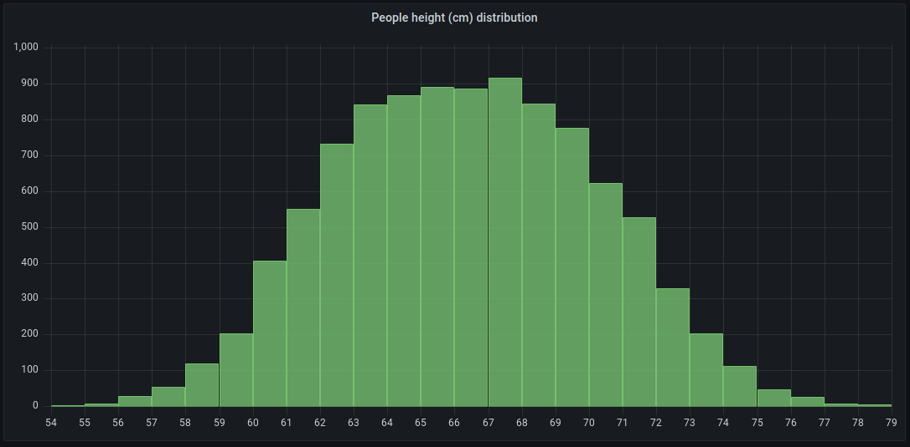

# Observability

### Collecting, Storing, and Querying Metrics With Prometheus

vvv


<!-- .element: class="r-stretch" -->

vvv

## Prometheus Overview


<!-- .element: class="r-stretch" -->

vvv

## Prometheus Workflow

1. Application or exporter exposes metrics via HTTP endpoint (instrumentation)
2. Configure Prometheus to scrape application/exporter (scrape config)
3. Prometheus determines targets for scrape configs (service discovery)
4. Prometheus fetches metrics from all targets at given intervals (scraping)
5. Prometheus stores collected metrics in database (time series data)
6. Query time series data using PromQL
7. Create dashboards and alerts based on queries

vvv

## Instrumentation

- Application code is modified to expose metrics
- Prometheus libraries available for various programming languages
- Define metrics (e.g., counters, gauges, histograms)
- Increment/update metrics in relevant parts of code (e.g., with every HTTP request)
- Expose metrics via HTTP endpoint (typically `/metrics`)
- Endpoint is scraped by Prometheus at regular intervals
- Endpoint returns current metric values in Prometheus text format

vvv

## Instrumenting a Go Application

```go[|2-6|8-14|10-11|16-17|19-23]
func main() {
	// Define a Prometheus counter metric
	requestsTotal := promauto.NewCounter(prometheus.CounterOpts{
		Name: "hello_requests_total",
		Help: "Total number of hello requests.",
	})

	// Application endpoint
	http.Handle("/hello", http.HandlerFunc(func(w http.ResponseWriter, req *http.Request) {
		// Increment the request counter
		requestsTotal.Inc()

		w.Write([]byte("Hello, Prometheus!\n"))
	}))

	// Metrics endpoint
	http.Handle("/metrics", promhttp.Handler())

	// Start the HTTP server
	log.Println("Starting server on :9090")
	if err := http.ListenAndServe(":9090", nil); err != nil {
		log.Fatal(err)
	}
}
```

vvv

## Instrumentation Results

```bash[1-4|6-7|9-12]
$ curl -sS localhost:9090/metrics | grep hello
# HELP hello_requests_total Total number of hello requests.
# TYPE hello_requests_total counter
hello_requests_total 0

$ curl localhost:9090/hello
Hello, Prometheus!

$ curl -sS localhost:9090/metrics | grep hello
# HELP hello_requests_total Total number of hello requests.
# TYPE hello_requests_total counter
hello_requests_total 1
```

vvv

## Instrumenting a Go Application (2)

```go[2-9|11-14|16-23]
func main() {
	// Define a Prometheus counter metric with labels
	requestsTotal := promauto.NewCounterVec(
		prometheus.CounterOpts{
			Name: "hello_requests_total",
			Help: "Total number of hello requests by request method and status code.",
		},
		[]string{"method", "code"},
	)

	// Application endpoint – automatically instrumented with Prometheus middleware
	http.Handle("/hello", promhttp.InstrumentHandlerCounter(requestsTotal, http.HandlerFunc(func(w http.ResponseWriter, req *http.Request) {
		w.Write([]byte("Hello, Prometheus!\n"))
	})))

	// Metrics endpoint
	http.Handle("/metrics", promhttp.Handler())

	// Start the HTTP server
	log.Println("Starting server on :9090")
	if err := http.ListenAndServe(":9090", nil); err != nil {
		log.Fatal(err)
	}
}
```

vvv

## Instrumentation Results (2)

```bash[1-2|4-7]
$ curl localhost:9090/hello
Hello, Prometheus!

$ curl -sS localhost:9090/metrics | grep hello
# HELP hello_requests_total Total number of hello requests by request method and status code.
# TYPE hello_requests_total counter
hello_requests_total{code="200",method="get"} 1
```

vvv

## Metrics Format

Simple text-based format including metric name, labels, and value:

```text
# HELP http_requests_total The total number of HTTP requests.
# TYPE http_requests_total counter
http_requests_total{method="GET", code="200"} 1027
http_requests_total{method="GET", code="404"}    3
http_requests_total{method="POST",code="201"}  441
```

Other available formats:
- OpenMetrics – text-based, also supports exemplars
- Protocol Buffers (protobuf) – binary, more efficient

vvv

## Prometheus Configuration

```yaml[1-3|5-9]
global:
  scrape_interval:     15s # Scrape targets every 15 seconds.
  evaluation_interval: 15s # Evaluate rules every 15 seconds.

# Configure scrape configs (jobs and targets)
scrape_configs:
- job_name: podinfo
  static_configs:
  - targets: ['10.0.0.1:9090', '10.0.0.2:9090']
```

vvv

## Service Discovery

- Dynamically discover targets via service discovery mechanisms, e.g., DNS, Kubernetes, Consul, etc.
- Enables automatic adaptation to changes in the environment (e.g., scaling, deployments)
- Prometheus queries service discovery APIs to get list of targets
- Targets can be filtered and relabeled using `relabel_configs`
- Result is a list of targets for each scrape config
  - Tuples of `job`, `instance` (`<host>:<port>`), and additional labels
  - These labels are added to all metrics scraped from the target
  - A target is usually single instance of an application, component, or exporter

vvv

## Service Discovery Example

```yaml[1-2|4-6|7-10|12-17|18-21]
scrape_configs:
- job_name: podinfo
  
  # dynamically discover targets via Kubernetes API
  kubernetes_sd_configs:
  - role: pod # list specified ports of pods ...
    namespaces:
      names: # ... in these namespaces
      - podinfo-dev
      - podinfo-prod
  
  # out of the listed pods, select the targets to scrape
  relabel_configs:
  # target pods starting with "podinfo-"
  - source_labels: [__meta_kubernetes_pod_name]
    regex: podinfo-.+
    action: keep
  # target the port named "http-metrics"
  - source_labels: [__meta_kubernetes_pod_container_port_name]
    regex: http-metrics
    action: keep
```

vvv

## Scraping

- Prometheus fetches metrics from targets at the specified scrape interval
- Performs HTTP `GET` requests to `<host>:<port>/metrics` for each target
- Parses the metrics returned in Prometheus text format
- Adds the labels from service discovery to the scraped metrics
- Automatically generates the `up` metric based on instance health:
  ```text
  # up == 1 if scrape was successful, 0 otherwise
  up{job="<job-name>", instance="<host>:<port>"} 1
  ```
- Stores the collected metrics in its time series database
- Each scrape adds a timestamp to the collected time series data


vvv

## Data Model

- Metric name: identifier for a specific measurement
- Labels: key-value pairs that provide additional context/dimensions
- Time series: unique combination of metric name and labels
- Sample: a single data point in a time series
  - consisting of a millisecond-precision timestamp and a float64 value

vvv

## Basic Metrics Types

All metrics are observed individually per application instance (target).

- Counter: monotonically increasing value (resets to zero on restart)
  - Metric name typically ends in `_total`
  - Example: number of HTTP requests served, jobs completed, errors occurred
- Gauge: arbitrary value that can go up and down
  - Example: current memory usage, temperature, number of active connections

vvv

## Metrics Types: Histogram

 [^grafana-histogram]
<!-- .element: class="r-stretch" -->

- Samples observations into configurable buckets (statistical distribution)
- Example: request latency, response sizes

[^grafana-histogram]: <https://grafana.com/docs/grafana/latest/fundamentals/intro-histograms/>

vvv

## Metrics Types: Histogram

- Represented by multiple time series:
  - `<metric_name>_bucket{le="<upper_bound>"}`: _cumulative count_ of observations ≤ upper bound
  - `<metric_name>_sum`: sum of all observed values
  - `<metric_name>_count`: total number of observations
- Allows calculation of quantiles (e.g., p95, p99) and averages during query time (on the Prometheus server side)
  - Use PromQL function `histogram_quantile()`

vvv

## Querying

- Queries can be executed via Prometheus API – or via web UI or Grafana
- Query types:
  - Instant query: retrieve current value of (multiple) time series at a specific time
  - Range query: retrieve values of (multiple) time series over a specified time range
- Data types:
  - Instant vector: set of time series containing a single sample at the same timestamp (can be displayed as a list/table)
  - Range vector: set of time series containing a range of samples over the same time range (can be displayed as a graph)

vvv

## Instant Vector Selectors

- Use metric name and label matchers to select time series
- Example: select all time series for HTTP requests of the `podinfo` application with non-200 status codes
  ```text
  http_requests_total{job="podinfo", code!="200"}
  ```
- Label matchers:
  - `=`: exact match
  - `!=`: not equal
  - `=~`: regex match
  - `!~`: regex not match

vvv

## Aggregation Operators

- Aggregate multiple time series (e.g., from different targets) into a single time series based on specified labels
- Common aggregation operators:
  - `sum`: sum of values
  - `avg`: average of values
  - `min`: minimum value
  - `max`: maximum value
  - `count`: count of time series

vvv

## Aggregation Operators (2)

- Aggregate over label dimensions:
  - All labels: no `by` or `without` clause
  - Aggregate by label values: `by (label1, ...)`
  - Aggregate by label values except specific labels: `without (label1, ...)`
- Example: sum of all HTTP requests across all instances of the `podinfo` application broken down by `namespace`
  ```text
  sum by (namespace) (http_requests_total{job="podinfo"})
  ```

vvv

## Range Vector Selectors

- Used as input for functions and operators that work on time ranges
- Syntax: `<instant_vector_selector>[<duration>]`
- Example: select HTTP requests over the last 5 minutes for the `podinfo` application
  ```text
  http_requests_total{job="podinfo"}[5m]
  ```

vvv

## Query Functions

- Functions operate on instant or range vectors to perform calculations and transformations
- Common functions:
  - `rate()`: calculates the per-second average rate of increase of a counter over a time range
  - `increase()`: calculates the total increase of a counter over a time range
- Example: calculate the per-second rate of HTTP requests over a sliding time window of 5 minutes for the `podinfo` application, aggregated by `namespace`:
  ```text
  sum by (namespace) (rate(http_requests_total{job="podinfo"}[5m]))
  ```

vvv

## Lab: Prometheus

- Open the Prometheus web UI via the Ingress created in the [previous lab](#/lab-kube-prometheus-stack).
- Explore the status pages (targets, service discovery, etc.) to understand what the Prometheus instance is monitoring (pre-configured by the kube-prometheus-stack).
- Navigate to the query page and explore the metrics collected by Prometheus.
- Run queries for the following tasks:
  1. List all nodes in the cluster. 
  2. Count the number of pods per namespace.
  3. Show the CPU and memory usage of the `prometheus` container in the `monitoring` namespace over the last hour. Verify your results by comparing them to the output of `kubectl top pods -n monitoring`.

<!-- .element: style="font-size: 0.8em;" -->
