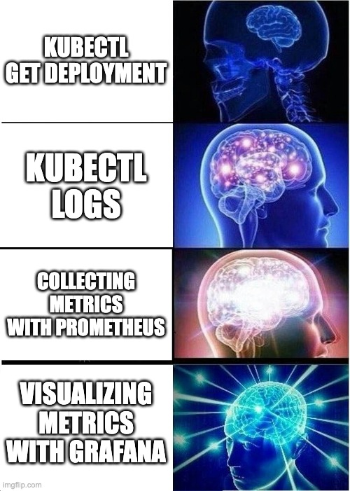
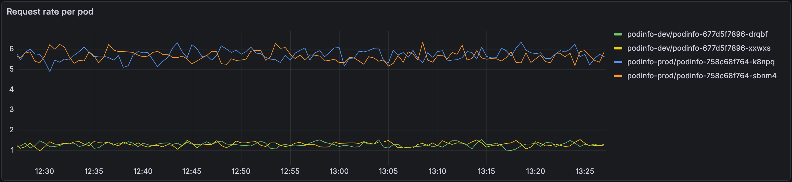
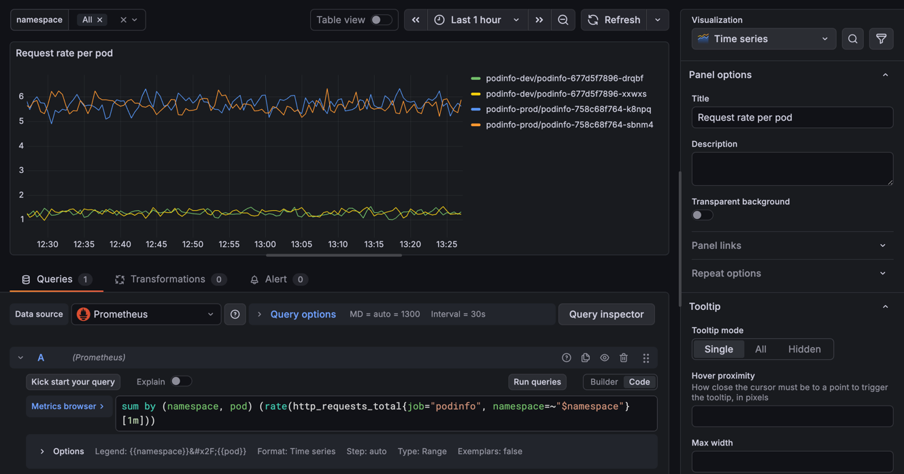
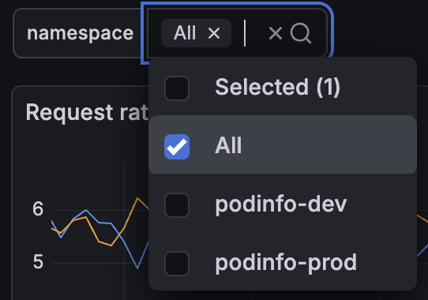
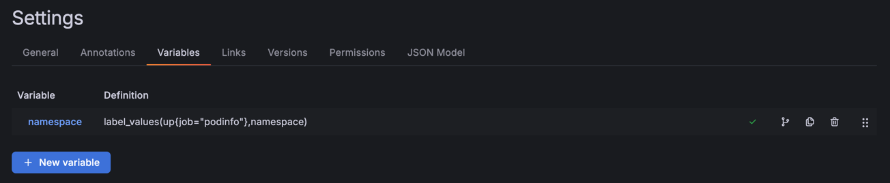
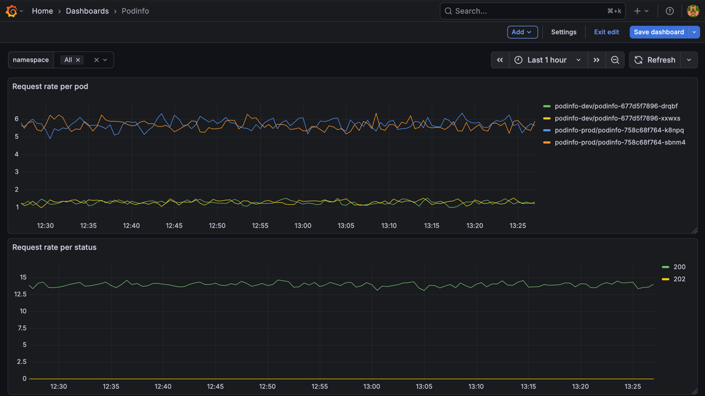

# Observability

### Visualizing Telemetry Data With Grafana

vvv


<!-- .element: class="r-stretch" -->

vvv

## What is Grafana?

- Open-source tool for visualizing telemetry data (metrics, logs, traces)
- Supports various data sources, e.g., Prometheus, Loki
- Create interactive and customizable dashboards
- Wide range of pre-built dashboards and plugins available

vvv

## Dashboard Panels


<!-- .element: class="r-stretch" -->

vvv

## Panel Queries


<!-- .element: class="r-stretch" -->

vvv

## Dashboard Variables


<!-- .element: class="r-stretch" -->

Use the selected variable value in panel queries:

```
sum(rate(http_requests_total{namespace=~"$namespace"}[5m])) by (pod)
```

vvv

## Variable Definitions


<!-- .element: class="r-stretch" -->

vvv

## Dashboard Example


<!-- .element: class="r-stretch" -->

vvv

## Lab: Grafana

- Open the Grafana instance created in the [previous labs](#/lab-kube-prometheus-stack).
- Create a new dashboard to visualize metrics scraped from the podinfo application deployed in the cluster.
- Add two panels to the dashboard visualizing time series as graphs:
  - HTTP request rate (requests per second) per instance (pod).
  - HTTP request rate (requests per second) per HTTP status code.
- Add a dashboard variable to filter the panels by a selected namespace (e.g., `podinfo-dev`, `podinfo-prod`).
